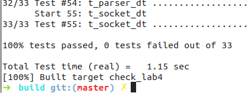

Lab 4 Writeup
=============

My name: [<font color="purple">刘轩昂</font>]

My Student number : [<font color="purple">201220198</font>]

This lab took me about [10] hours to do. 

### 1. Program Structure and Design:

本次实验实现`TCP sender`的相关接口。

### 2. Implementation :

为了方便实现实验目的，现引入一些添加的变量和函数：
``` cpp
    // tcp_sender.hh
    uint64_t _bytes_in_flight = 0; 
    bool _syn = false; 
    bool _fin = false;
    bool _timer_is_running = false; // flag
    size_t _timer = 0; // 重传计时器
    size_t _retransmission_times = 0; // 重传计数
    unsigned int _retransmission_timeout; // 重传等待时间
    uint16_t _receiver_window_size = 0; 
    uint64_t _recieved_ackno = 0;
    std::queue<TCPSegment> _segments_wait{}; // 等待返回接收成功的段
    void sending_operations(TCPSegment& seg); // 发送TCP segment
```
依次实现接口函数
``` cpp
    // tcp_sender.cc
void TCPSender::sending_operations(TCPSegment& seg){
    //push segment on to the _segments_out queue
    seg.header().seqno = wrap(_next_seqno, _isn);
    _segments_out.push(seg);
    _segments_wait.push(seg);
    // set timer
    if (!_timer_is_running){
        _timer = 0;
        _timer_is_running = true;
    }
    _next_seqno += seg.length_in_sequence_space();
    _bytes_in_flight += seg.length_in_sequence_space();
}
```

### 3. Tests:



